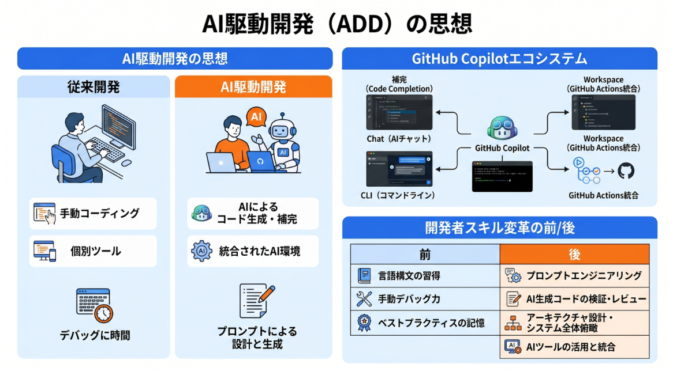
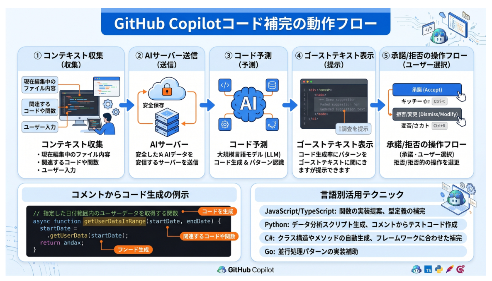
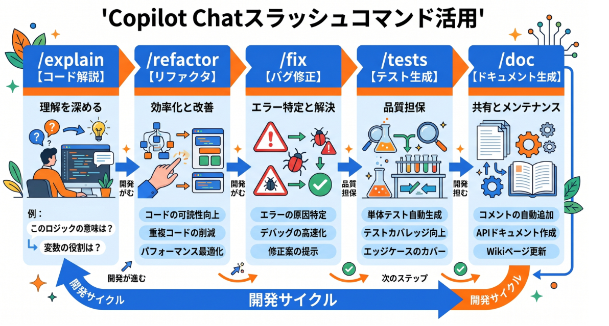

# GitHub Copilot 徹底解説

## AI駆動開発(ADD)の思想 - GitHub Copilot が変えるソフトウェア開発の本質


---
### 1-1. AI駆動開発(ADD)とは
- AI駆動開発(ADD: AI-Driven Development)とは、AIを開発プロセスの各段階に積極的に統合し、人間の創造性とAIの生産性を組み合わせたソフトウェア開発の新しいアプローチです。
- 従来の開発では、すべてのコードを人間が書いていました。しかし、ADDでは、
  - **実装の詳細**: AIが提案・補管する
  - **ボイラープレートコード**: AIが自動生成する
  - **テストコード**: AIが自動生成する
  - **ドキュメント**: AIが自動生成する
  - **設計・アーキテクチャ**: 人間が主導する
  - **ビジネスロジック**: 人間が定義する
  - **品質判断**: 人間がレビューする
この分業により開発者はより創造的で価値の高い作業に集中できる。
---
### 1-2. GitHub Copilotの仕組み
- GitHub Copilotは、OpenAIのCodexモデル(GPT-4をコードに特化した派生モデル)をベースにしたAIコーデイングアシスタントです。

- **動作の仕組み**
  1. 開発者がIDEでコードを書く
  2. GitHub Copilotが現在の「コンテキスト」を収集(開いているファイル・カーソル前後のコード・コメント・ファイル名)
  3. そのコンテキストをサーバー上のAIに送信
  4. AIが最も適切なコードの続きを予測・生成
  5. IDEに提案コードを表示(ゴーストテキスト)

---
### 1-3. GitHub と OpenAIの協業
- GitHubは、OpenAIと協業し、2021年にGitHub Copilotを最初にリリースしました。
- GitHubに公開されている数十億行のコードを学習データとし使用し、人類が蓄積したプログラミン知識をAIに凝縮させている。

---
### 1-4. GiHub Copilotのエコシステム
- GitHub Copilotは複数の製品・機能から構成される。

| 製品・機能                  | 説明                                |
| :-------------------------- | :---------------------------------- |
| GitHub Copilot(IDE補完)     | VS Code等でのリアルタイムコード補完 |
| GitHub Copilot Chat         | 会話形式でコードを解説・修正        |
| GitHub Copilot CLI          | ターミナルでのAI支援                |
| Codex CLI                   | コマンドラインAI駆動自動化          |
| GitHub Copilot Workspace    | エージェント型タスク駆動開発        |
| GitHub Actions(Copilot統合) | CI/CDパイプラインのAI最適化         |

---
### 1-5. 開発者の生産性への影響
- GitHubの調査によると、GitHub Copilotを使った開発者は：
  - コードディング速度が平均55%向上
  - コードの完成に費やす時間が46%削減
  - 開発者の88%が「より集中できる」と回答
  - 繰り返しの多いタスクの完了速度が77%向上
これらの数字は、単なる「コード補完ツール」を超えた本質的な開発体験の変換を示している。
---
### 1-6. AI時代のエンジニアのスキル変革
- AI駆動開発が主流になる中で、エンジニアに求められるスキルが変わっている

| 従来のスキル(重要性が下がる) | AI時代のスキル(重要性が上がる) |
| :--------------------------- | :----------------------------- |
| ライブラリのAPIの暗記        | 問題の本質を定義するスキル     |
| ボイラーテンプレートの手書き | AIへの指示(プロンプト)の精度   |
| 繰り返しパターンの実装       | コードレビュー・品質判断能力   |
| 検索してコピペ               | AIの出力を評価・補正する能力   |
---
### 1-7. AIとペアプログラミング
- GitHub Copilotは「AIペアプログラマー」と表現されることがある。
- 伝統的なペアプログラミングと同様に、AIが「ドライバー(コードを書く人)」か「ナビゲーター(コードレビューする人)」の役割を担い、人間は逆の役割を行う。
---
### 1-8. まとめ
- GitHub CopilotはAI駆動開発の最前線に位置するツールであり、開発者の生産性を大幅に向上させる。
- AIは実装の助手になり人間はより創造的な問題解決に集中できる。
- この新しい開発スタイルを習得していこう
---
## GitHub Copilot基本活用 - コード補完・インライン提案・マルチライン生成


---

### 2-1. インストールと設定
- **VS CodeへのGitHub Copilot拡張機能インストール**
  1. VS Codeを開き、拡張機能マーケットプレースを開く(Ctrl+Shift+X)
  2. 「GitHub Copilot」を検索してインストール
  3. Copilotアイコンがステータスバーに表示されたら完了
  4. GitHubアカウントでサインイン
- **対応するIDE**

| IDE                            | 対応状況       |
| :----------------------------- | :------------- |
| Visual Studio Code             | 完全対応(推奨) |
| Visual Studio 2022             | 対応           |
| JetBrains (IntelliJ/PyCharm等) | 対応           |
| Neovim                         | 対応           |
| XCode                          | 対応           |

---
### 2-2. コード補完の基本操作
- **ゴーストテキスト(インライン提案)**
  - コードを書き始めると、GitHub Copilotが「ゴーストテキスト」(薄いグレーで表示される提案コード)を自動的に表示します。

  | 操作             | キー         |
  | :--------------- | :----------- |
  | 提案を承諾       | Tab          |
  | 提案を拒否       | Esc          |
  | 次の提案を表示   | Alt + ]      |
  | 前の提案を表示   | Alt + [      |
  | 複数の提案を表示 | Ctrl + Enter |

---
### 2-3. コメントからコードを生成する
- GitHub Copilotの強力な機能の一つがコメントから実装コードを生成する機能。
- **実装例 (Python)**
  ``` Python
  # 日付のリストを受け取り、最新の日付を返す関数
  def get_latest_date(dates):
    # -> Copilotがここにコードを自動補完
  ```
  ```Python
  def get_latest_date(dates):
    return max(dates)
  ```
- **より詳細なコメントでより良い実装を得る**
  ``` Python
  # Excelファイルを読み込み、指定した列でフィルタリングして
  # 新しいCSVファイルに保存する関数
  # 引数：file_path(str),column_name(str),filter_value(any)
  # 戻り値：保存したCSVファイルのパス(str)
  def filter_and_save(file_path, column_name, filter_value):
    # Copilotが完全な実装を生成
  ```
---
### 2-4. マルチライン・複数ファイルの補完
- 複数行にわたるコードブロックも、Copilotは自動で生成する
- **クラス定義の例**
  ```Python
  class Customer:
    """ 顧客情報を管理するクラス """
    # -> Copilotがコンストラクタ・プロパティ・メソッドの完全な実装を提案
  ```
---
### 2-5. 言語別の活用テクニック
- **Python**
  - 型ヒント(Type Hints)を使うとより精度の高いコードが生成される
  - docstringを記載すると、関数の仕様を理解した実装が生成される
- **JavaScript/TypeScript**
  - TypeScriptの型定義を明示すると型安全なコードが生成される
  - JSDocコメントが型推論の精度向上に貢献
- **SQL**
  - テーブルのDDL(CREATE TABLE文)をコメントで提供すると正確なSELECT文が生成される。
---
### 2-6. コンテキストを活用したより良い補完
- GitHub Copilotは「コンテキスト」を参照して補完を行います。コンテキストには以下が含まれる。
  - 現在のファイルの内容
  - 開いている他のタブのファイル
  - ファイル名・拡張子(プログラミング言語の推測)
  - コード内のコメント・変数名・関数名
- より良い補完のために：
  1. 意味のある変数名・関数名を使う
  2. 詳細なコメントを書く
  3. 関連するファイルを同時に開いておく
---
### 2-7. 提案の評価と選択
- Copilotが提案したコードは、必ず内容を確認してから承諾することが重要である。
- **チェックポイント**
  - ロジックが意図した通りか確認する
  - エラーハンドリングが適切か確認する
  - セキュリティ上の問題がないか確認する(SQLインジェクション・XSS等)
  - パフォーマンス上の問題がないか確認する
---
### 2-8. まとめ
- GitHub Copilotのコード補完機能は、適切なコメントとコンテキストを提供することで、高品質なコードを素早く生成できる。
- Tabで承諾する前に必ずコードを確認する習慣をつけることが、高品質な開発を維持するための鍵である。

---

## Copilot Chat徹底活用 - コード解説・リファクタ・バグ修正・テスト生成



---
### 3-1. GitHub Copilot Chatとは
- GitHub Copilot ChatはIDEのサイドパネルに統合されたAIチャットインターフェースである。
- コードについて自然言語で質問・指示することでコードの解説・修正・生成をインタラクティブに行える
- **起動方法 (VS Code)**
  - サイドバーのCopilotアイコンをクリック
  - ショートカット：Ctrl + ALt + I(Windows)/Cmd + Option + I(Mac)
  - コードを選択して右クリック -> 「Copilotに相談」
---
### 3-2. コードの解説を得る
- **スラッシュコマンド: /explain**
  ```
  /explain このコードが何をしているか日本語で説明してください
  ```
  - コードを選択してCopilot Chatで「/explain」コマンドを使うと、そのコードの動作を日本語で詳しく説明してくれる。
- **活用シーン**
  - 引き継いだコードの理解(レガシーコードの読み解き)
  - OSSのライブラリコードの動作確認
  - 複雑なアルゴリズムの理解
  - チームメンバーが書いたコードのレビュー
---
### 3-3. リファクタリングの支援
- **スラッシュコマンド: /refactor**
  ```
  /refactor このコードをPEP8に準拠してリファクタリングしてください
  /refactor このコードをより可能性の高い形に書きなおしてください
  /refactor このループをリスト内包表記に変換してください
  ```
- **よくあるリファクタリング依頼**
  - 「長い関数を小さな関数に分類してください」
  - 「重複したコードを関数化してください」
  - 「マジックナンバーを定数化してください」
  - 「ネストが深すぎるので早期returnを使って改善してください」
  - 「このクラスのSOLID原則に違反している部分を修正してください」
---
### 3-4. バク修正の支援
- **スラッシュコマンド: /fix**
  ```
  /fix このコードのバグを特定して修正してください
  ```
  - バグがあると思われるコードを選択して、/fixを使うと、Copilotがバグの原因を特定して修正案を提示する。
- **バグ修正の実践例**
  - エラーメッセージをそのままCopilot Chatに貼り付けることで、原因と解決策を提示してもらえる。
  ```
  以下のエラーが発生しています。原因と修正方法を教えてください:
  TypeError: 'NoneType' object is not subscriptable
  スタックトレース:
    File "app.py", line 45, in process_data
      result = data['items'][0]
  ```
---
### 3-5. テストコードの自動生成
- **スラッシュコマンド: /tests**
  ```
  /tests この関数のユニットテストをpytestで書いてください
  ```
  - テストコードを手書きする時間を大幅に削減できる
- **テスト生成の実践**
  - 関数を選択して/testsを実行すると、以下のようなテストコードが自動生成される。
    - 正常系のテスト(期待する入力と出力)
    - 異常系のテスト(エッジケース・例外ケース)
    - モック・フィックチャの設定
---
### 3-6. ドキュメントの自動生成
- **スラッシュコマンド: /doc**
  ```
  /doc この関数にdocstringを追加してください
  ```
  - docstring(関数の説明)を自動生成し、API仕様の整備を効率化できる
---
### 3-7. セキュリティレビューへの活用
- Copilot Chatはセキュリティの観点からコードをレビューすることもできる
- 「このコードに脆弱性(SQLインジェクション・XSS・認証漏れ等)がないか確認してください」
- ただし、AIのセキュリティレビューは専門家によるレビューの代替にはならないため、補助的な利用にとどめることを推奨。
---
### まとめ
- GitHub Copilot Chatは、コードの解説・リファクタ・バグ修正・テスト生成をインタラクティブに支援する
- スラッシュコマンドを使いこなすことで、開発の各場面でAIの力を最大限に引き出せる。